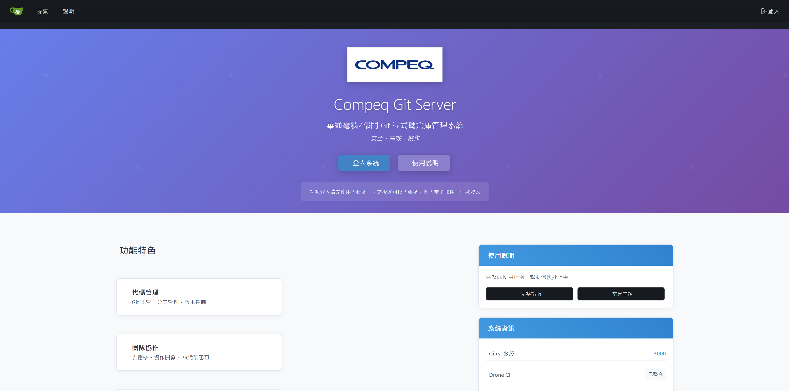
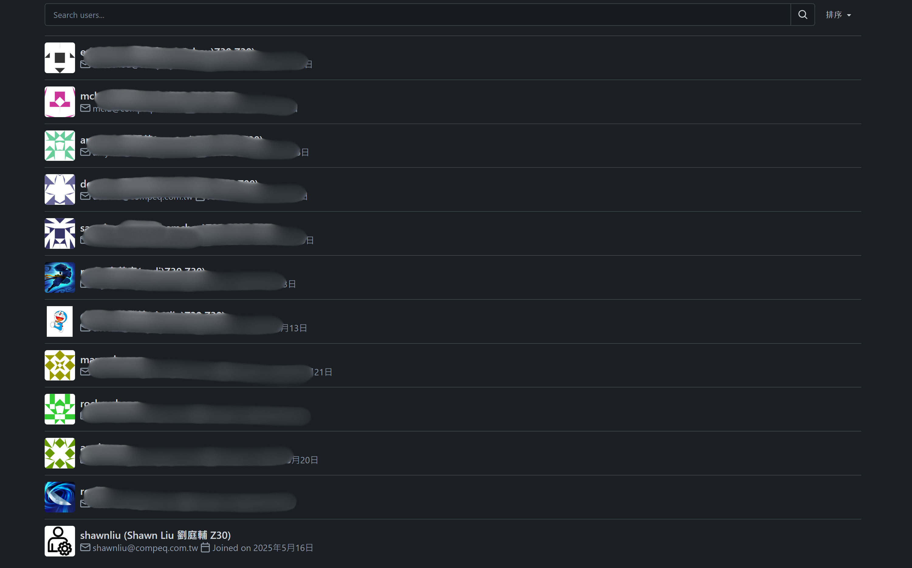
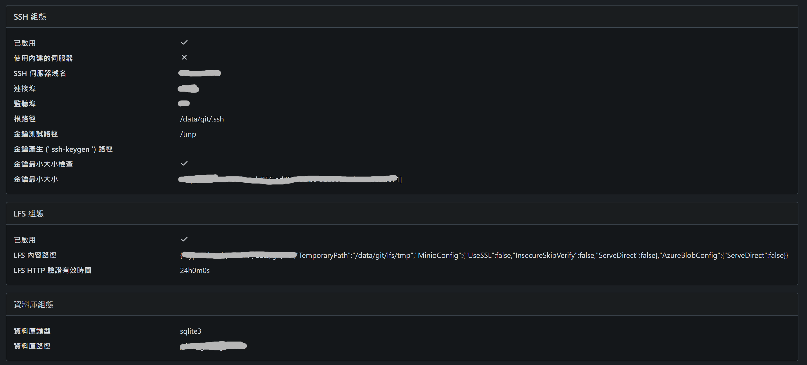
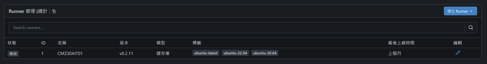

# 🚀 Compeq Internal Git-Server Deployment and Optimization



## 📋 專案概述

此專案為華通電腦Z部門內部程式協作庫，基於 **Gitea** 構建的企業級 Git 伺服器解決方案。採用 Docker 容器化部署，提供安全、高效的程式碼版本控制和團隊協作平台。

## ✨ 主要特色

### 🏢 企業客製化
- **品牌整合** - 華通電腦 Compeq Inc.
- **AD域整合** - 支援Active Directory統一身份驗證
- **多語言介面** - 繁體中文本地化界面，以及符合各廠區多元化語言的選擇

### 🔧 核心功能
- **Git 託管** - 完整的Git版本控制功能
- **團隊協作** - Pull Request程式碼審查機制
- **SSH/HTTPS** - 多種存取方式支援
- **大檔案支援** - Git LFS大檔案版本控制
- **CI/CD整合** - Git Actions自動化建置部署(建置runners在伺服器主機)

### 🛡️ 安全性
- **私有部署** - 企業內部網路環境
- **權限控制** - 精細的用戶權限管理
- **分支保護** - 主分支合併規則控制


| 功能 | 說明 |
|------|------|
|  | **系統首頁**  |
|  | **用戶管理** - AD整合，可撰寫組織規則 |
|  | **SSH與LFS** - 支援SSH金鑰認證和大檔案版本控制 |
|  | **CI/CD流程** - Git Actions自動化建置和部署 |

## 🏗️ 技術架構

```yaml
架構組成:
├── Gitea Server (Port: XXXX)    # 主要Git服務
├── SSH Service (Port: XXXX)     # SSH Git存取
├── Docker Compose              # 容器部屬
├── Custom Templates            # 客製化模板
└── User Documentation         # 完整使用文檔
```


1. **容器化部署**: Docker部屬應用，可以build成image提供其他部門使用。
2. **系統客製化**: 透過custom與compose.yaml可客製化系統架構。
3. **DevOps實踐**: CI/CD基礎設施，供大家撰寫workflow腳本，可做測試與部屬自動化。
4. **用戶體驗**: 移除預設landing page，改用公司品牌形象首頁。
5. **文檔管理**: 完整的技術文檔和用戶手冊，讓初學者也可以快速上手。

---

> 💡 **專案亮點**: 成功將開源Gitea轉化為符合企業需求的內部Git伺服器，提升團隊協作效率並確保程式碼資產安全性。

*此專案作為履歷作品集展示，體現了從系統規劃、部署實施到用戶培訓的完整專案管理能力。*
